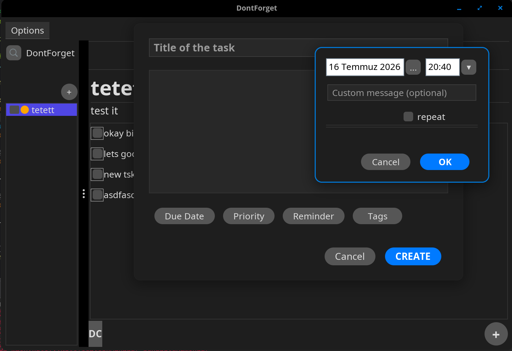
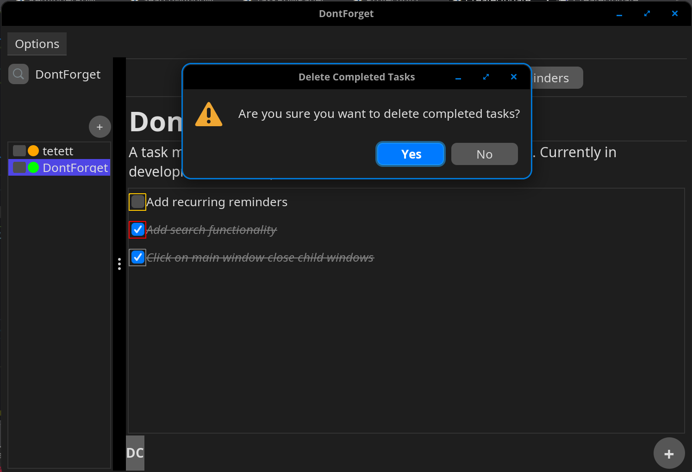
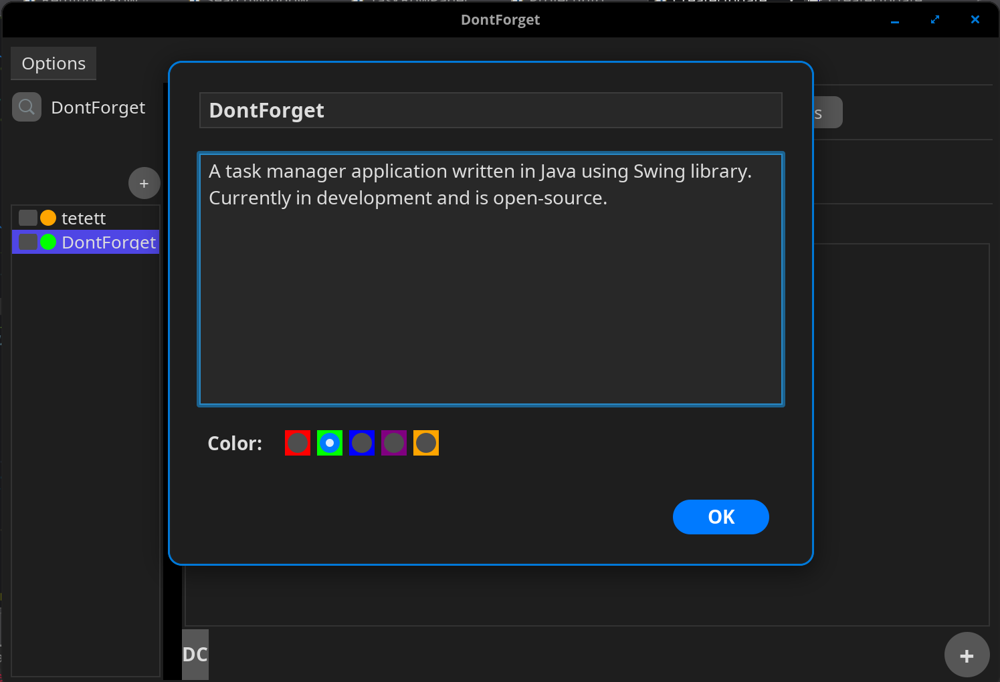
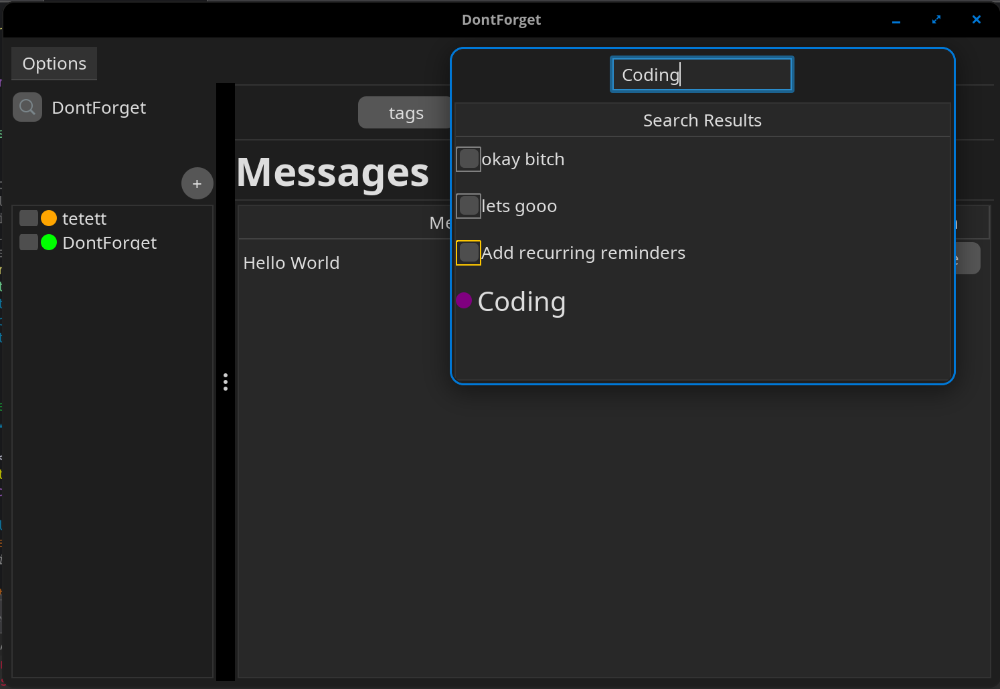
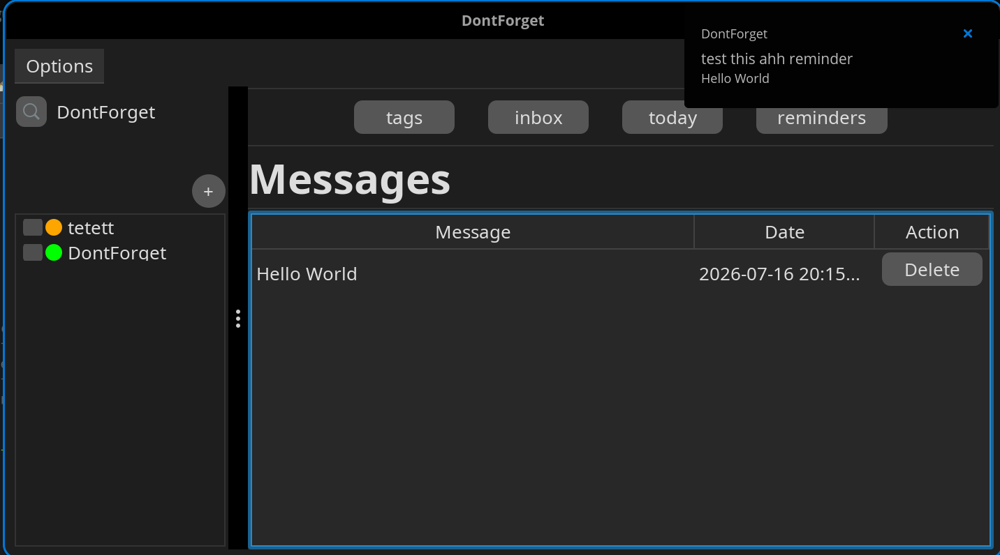
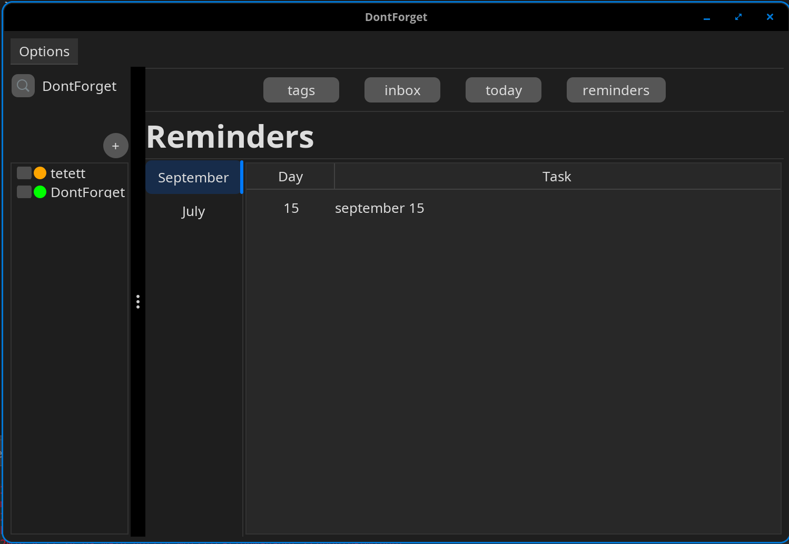

# DontForget
Task Manager Desktop Application

The app is fully functional in Pop_OS! and not optimized or prepared for other systems.

### Create Task
You can create and update tasks using "+" button located under a project panel.
A task requires a project.

### Delete Completed Tasks
You can delete completed tasks permanently with one button click.
"DC" stands for "Delete Completed". Currently not working on any icon designs.

### Create Projects

You can create, update and delete projects. To update or delete single project, right click on the project you want to perform the action. A popup menu will appear and you can edit or delete it.
You can also delete multiple projects at once. Click checkbox of projects you want to delete, a button will appear on top, clicking on it will delete selected projects.

### Search Everything

You can search nearly anything. I haven't added searching buttons and still working on searching-performing actions on reminders.
Searching tasks by tags works by setting tag names as tooltip of task row panels. 

### View Notification Messages

You can view notifications sent to you at which date-time and delete them.

### Reminders

You can view existing reminders, and delete them. Updating function still in development.
Also, clicking on reminder will open task connected to that reminder. You can perform edit operations in that task.

## For Now

The application is still in development. I'm planning to:
- Fill empty actions.
- Add functionality to run terminal script at the reminder time.
- Notification support for multiple operating systems.

As I said, the app is currently fully functional in Pop_OS! only.
