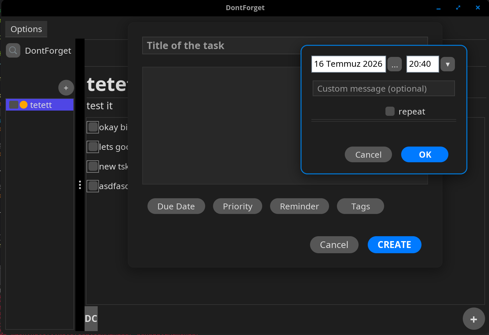
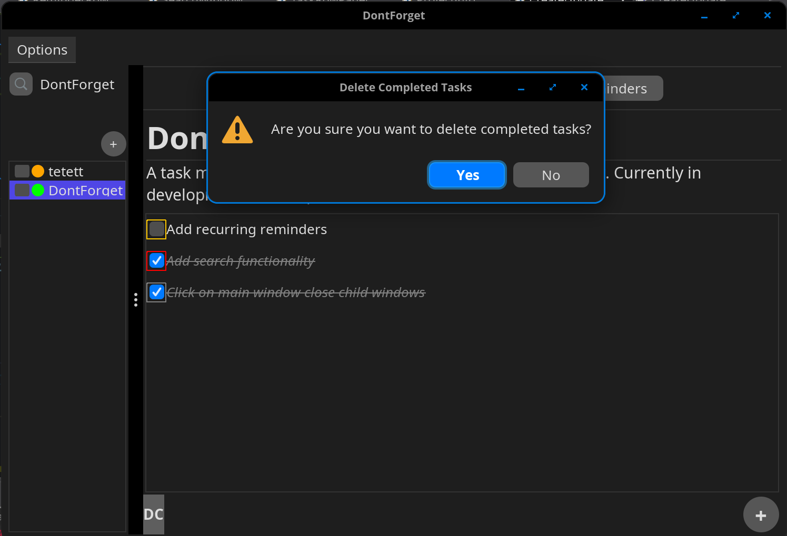
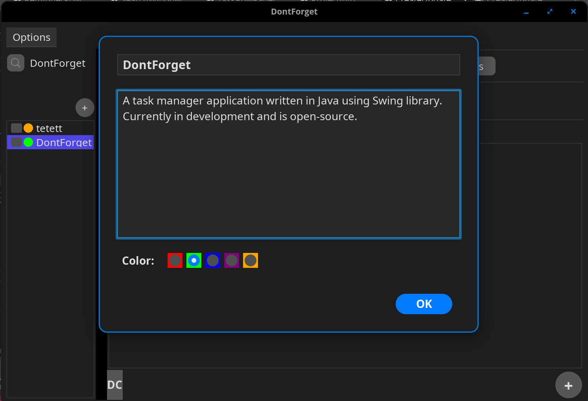
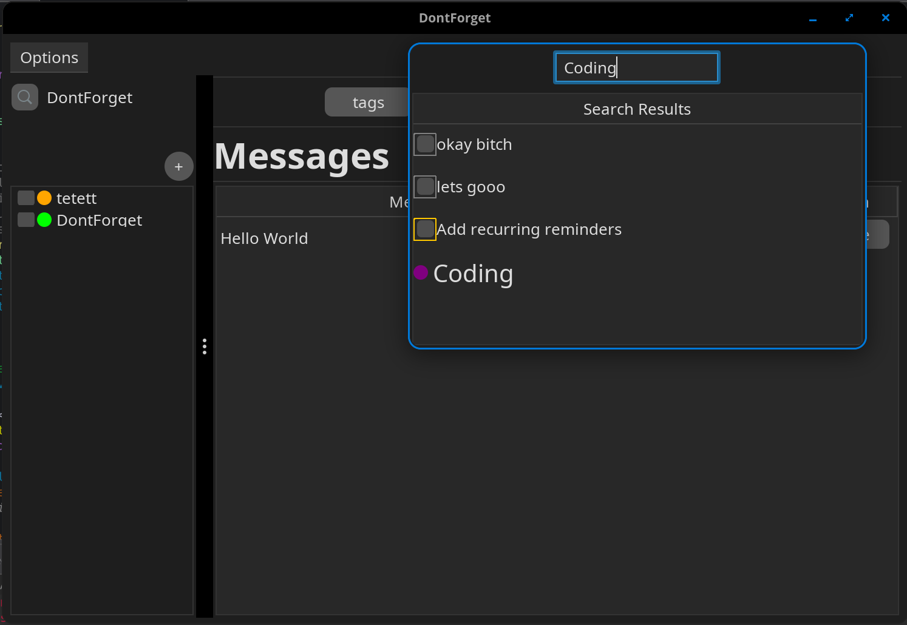
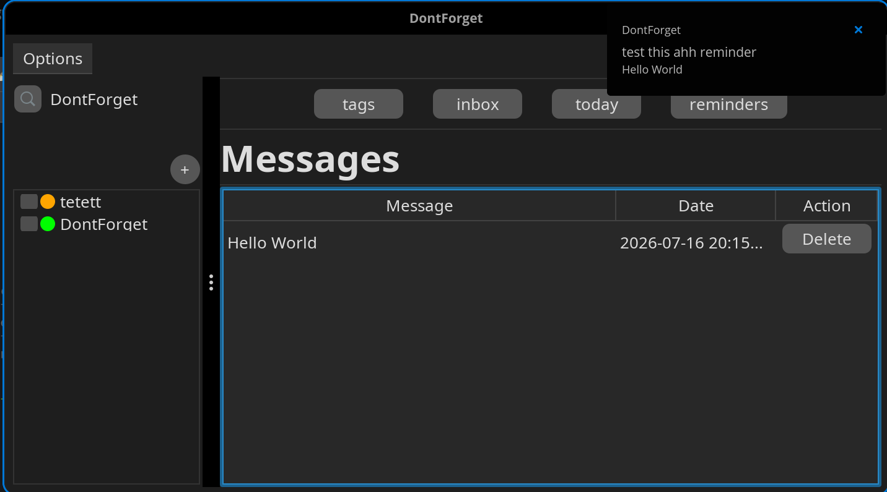
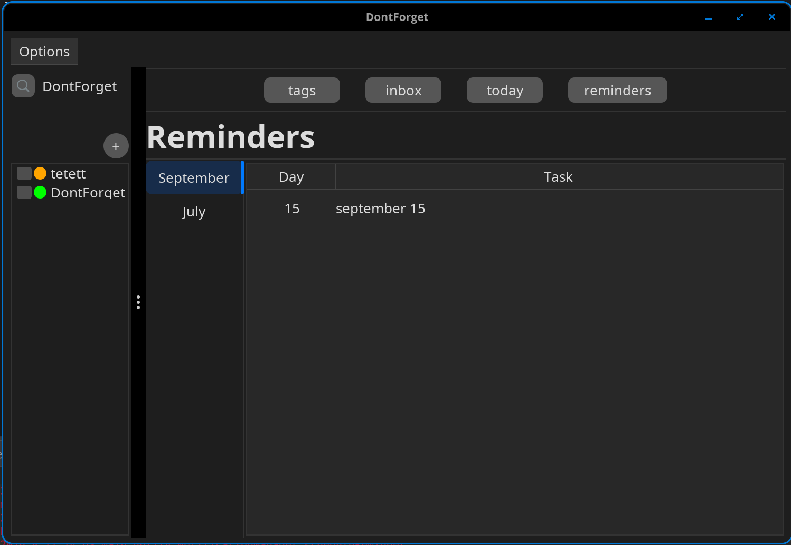

# DontForget
> A task manager desktop application built with Java Swing and Spring Boot.

---

## ✨ Features

### 📝 Create Task
You can create and update tasks using the **"+"** button located under a project panel.
A task requires a project.



---

### 🗑️ Delete Completed Tasks
You can delete completed tasks permanently with one button click.
**"DC"** stands for *"Delete Completed"*. Currently not working on any icon designs.



---

### 📁 Create Projects
You can create, update and delete projects. To update or delete a single project, right-click on the project you want to perform the action on — a popup menu will appear where you can edit or delete it.
You can also delete multiple projects at once. Click the checkbox of projects you want to delete; a button will appear on top, and clicking it will delete the selected projects.



---

### 🔍 Search Everything
You can search nearly anything. Searching tasks by tags works by setting tag names as the tooltip of task row panels.
I haven't added searching buttons yet and I'm still working on searching and performing actions on reminders.



---

### 🔔 View Notification Messages
You can view notifications sent to you — including the date-time they were sent — and delete them.



---

### ⏰ Reminders
You can view existing reminders and delete them. The update function is still in development.
Clicking on a reminder will open the task connected to it, where you can perform edit operations.



---

## 📦 Installation

### Option 1 — Debian Package (`.deb`) — Recommended
The easiest way to install on Debian-based systems (Ubuntu, Linux Mint, etc.):

```bash
sudo dpkg -i DontForget-<version>.deb
```

Once installed, launch the app from your application menu or run:

```bash
dontforget
```

The `.deb` package installs the JAR to `/usr/share/DontForget/` and registers a launcher at `/usr/bin/dontforget`. User data (database and settings) is stored in your home directory and is preserved across reinstalls.

---

### Option 2 — JAR File
Requires **Java 17 or later** to be installed on your system.

```bash
java -jar DontForget-<version>.jar
```

User data will be created automatically on first launch at:
- **Database:** `~/.local/share/DontForget/db/`
- **Settings:** `~/.config/DontForget/settings.json`

---

## 🚧 Roadmap

The application is still in development. I'm planning to:

- Add settings window.
- Add option to run the app on background.
- Add functionality to run a terminal script at reminder time.
- Changing UI design. Backgrounds or text font families etc.

